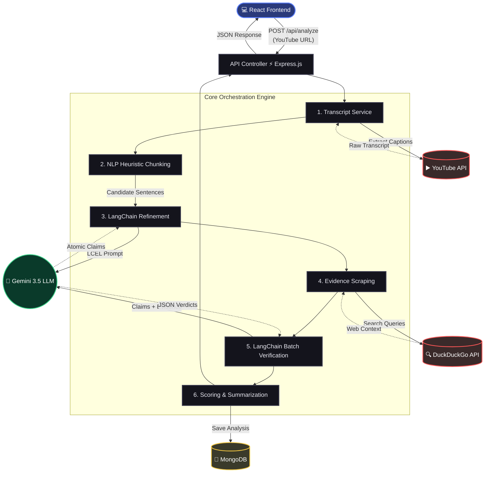

# VeriTube: YouTube Content Verification System

VeriTube is a full-stack web application that automatically extracts, fact-checks, and summarizes factual claims from YouTube videos. It uses heuristic analysis to identify candidate claims from transcripts, LLMs to refine these claims, and automated web search to gather evidence and render verdicts.

## Project Overview

The system takes a YouTube URL as input, retrieves its transcript, and executes a rigorous verification pipeline. It evaluates the credibility of the video's core statements against external evidence and provides an easy-to-understand credibility score. 

Recent updates include batch processing for speed, strict anti-hallucination guardrails, and persistent history storage via MongoDB.

## Architecture

The application employs a multi-stage data pipeline combining deterministic NLP heuristics, LangChain orchestration, and external web APIs. 

### High-Level Flow

```mermaid
graph TD
    A([💻 React Frontend]) -->|YouTube URL| B(⚡ Express Backend)
    
    subgraph Verification Pipeline
        direction TB
        C[1. Fetch YouTube Transcript]
        D[2. Heuristic & LangChain Refinement]
        E[3. DuckDuckGo Evidence Scraping]
        F[4. LangChain Batch Verification]
        
        C --> D --> E --> F
    end

    B --> Verification Pipeline
    
    F -->|Save Result| G[(🍃 MongoDB)]
    F -->|Return Data| A
```

### Detailed System Architecture



## Backend Structure

- `backend/controllers/analyzeController.js`: HTTP controller. Validates the request, delegates to the pipeline, handles status codes, and serves analysis history from MongoDB.
- `backend/pipeline/verificationPipeline.js`: The main application orchestrator coordinating all internal workflows.
- `backend/pipeline/claimExtractor.js`: Deterministic extraction logic. Chunks transcript sentences using an overlapping sliding window (45 words), scores them heuristically to find candidate claims, and deduplicates/ranks them.
- `backend/models/Analysis.js`: Mongoose schema for storing complete analysis results in MongoDB.
- `backend/langchain/`: Houses all LLM interactions and chains.
  - `chains.js`: Contains LangChain chains for extracting checkable claims, batch-verifying them against gathered evidence, and generating the final summary. Strict anti-hallucination prompts are enforced.
  - `modelProvider.js`: Resolves the LLM provider (defaulting to `gemini-3.5-flash-lite`).
  - `schemas.js`: Zod schemas for structured LLM outputs.
- `backend/services/`: External API interaction services.
  - `transcriptService.js`: Fetches YouTube transcripts (or returns a mock transcript for testing).
  - `scrapingService.js`: Executes DuckDuckGo web scraping to find evidence.
- `backend/scoring/scoring.js`: Calculates the final credibility score based on individual claim verdicts and confidence intervals.

## Claim Extraction & Refinement

The claim extraction process is decoupled into two stages for precision and reliability:

1. **Heuristic Candidate Discovery**: The transcript is parsed into overlapping 45-word chunks and scored deterministically based on indicators like percentages, measurements, causal language, and attribution. The top candidates are passed to the next stage.
2. **LLM Semantic Refinement**: The LLM refines the provided candidates, filtering out subjectivity and emitting fully self-contained atomic claims. Strict prompts prevent the LLM from hallucinating context or inventing numbers/facts that are not explicitly present in the original chunks.

## Evidence Gathering & Batch Verification

Once claims are extracted, the system sequentially searches DuckDuckGo for contextually relevant evidence for each claim.

After gathering evidence, a **batch verification chain** reviews all claims simultaneously against their respective evidence. It returns structured `Supported`, `Disputed`, or `Uncertain` verdicts, accompanied by a confidence score, detailed reasoning, and cited source indices.

## API

### `POST /api/analyze`
Analyzes a YouTube video.
**Request Body**: `{ "url": "https://www.youtube.com/watch?v=..." }`
**Response**: A structured JSON object containing the overall score, summary, and a list of verified claims.

### `GET /api/history`
Retrieves a lightweight summary of up to 50 previously analyzed videos from MongoDB.

### `GET /api/history/:id`
Retrieves the complete, detailed analysis record for a specific video check from MongoDB.

## Environment Variables

The backend relies on the following `.env` configuration:
- `PORT`: Server port (default: 5000)
- `MONGODB_URI`: Connection string for MongoDB (default: `mongodb://localhost:27017/youtube-verifier`)
- `LLM_PROVIDER`: E.g. `google`, `openai`, `mock`
- `GOOGLE_API_KEY`: API key for Gemini.
- `GEMINI_MODEL`: Model name (default: `gemini-3.5-flash-lite`)
- `USE_MOCK_TRANSCRIPT`: `true`/`false` for testing without YouTube access.

## Running Locally

1. **Prerequisites:** Ensure you have Node.js (v18+) and a running MongoDB instance.
2. **Install dependencies:**
   ```bash
   cd backend && npm install
   cd ../frontend && npm install
   ```
3. **Start the backend:**
   Create a `.env` file in the `backend` folder with your `GOOGLE_API_KEY`, then run:
   ```bash
   cd backend
   npm run dev
   ```
4. **Start the frontend:**
   ```bash
   cd frontend
   npm run dev
   ```
5. **Open VeriTube:** Navigate to `http://localhost:5173` in your browser.
